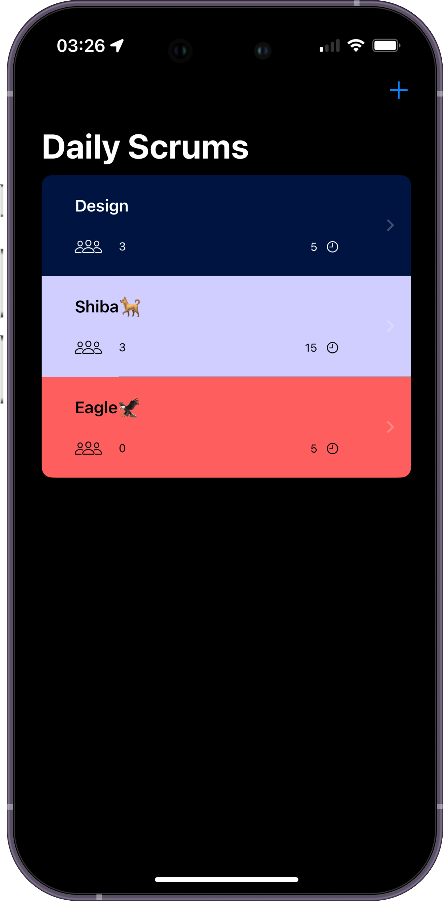
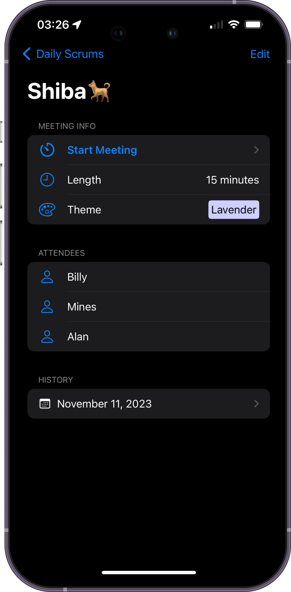
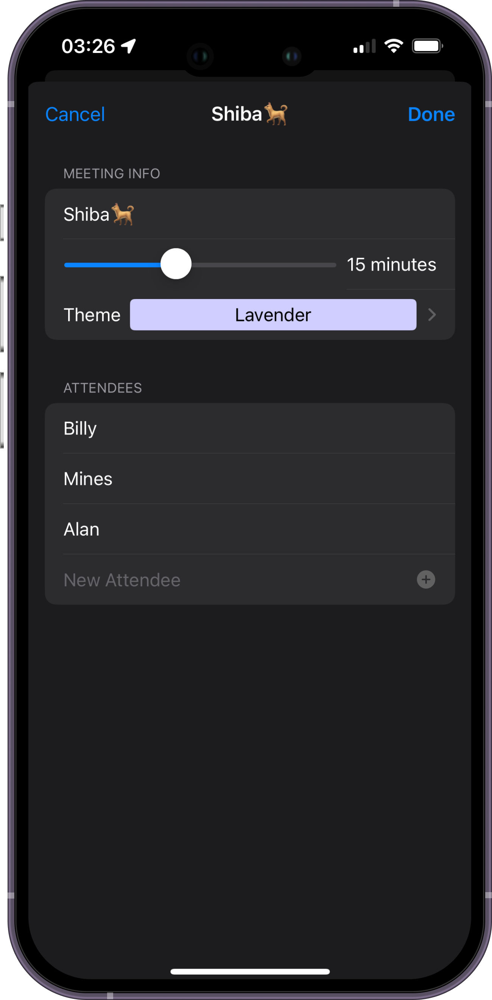
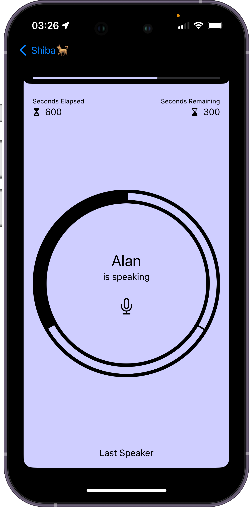

# iOSAppDevTutorial

## Scrumdinger

It is a walkthrough of [Scrumdinger](https://developer.apple.com/tutorials/app-dev-training) by Apple, including

- 🎨 Crafting an adaptive user interface with SwiftUI, including Card View and List View
- 🗺️ Building a seamless navigation hierarchy using NavigationView
- 🔄 Managing data flow between views for data synchronization
- ⚙️ Managing the data persistency and concurrency with async/await
- ✏️ Drawing views by defining shapes with SwiftUI's powerful geometry tools
- 🗣️ Transcribing speech using the Speech Framework

 

    
    
    
    

 

## Features

- [x] Scrum list
- [x] Scrum detail and edit
- [x] Meeting timer
- [x] Speech Transcribe

## Requirements

- iOS 16.0+
- Xcode 15
